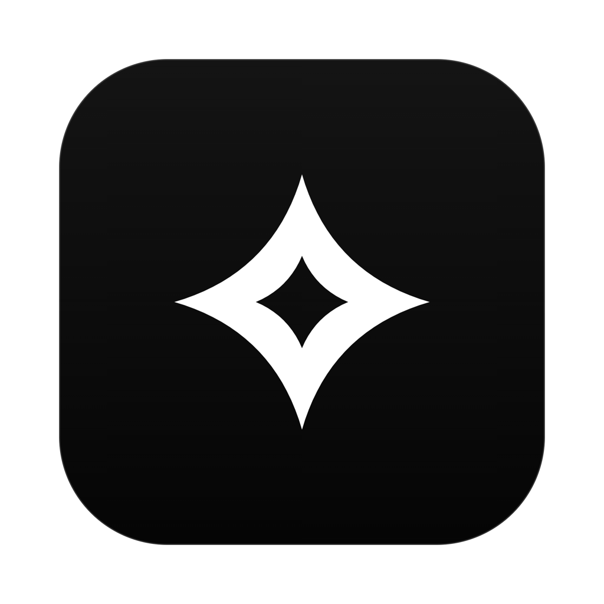
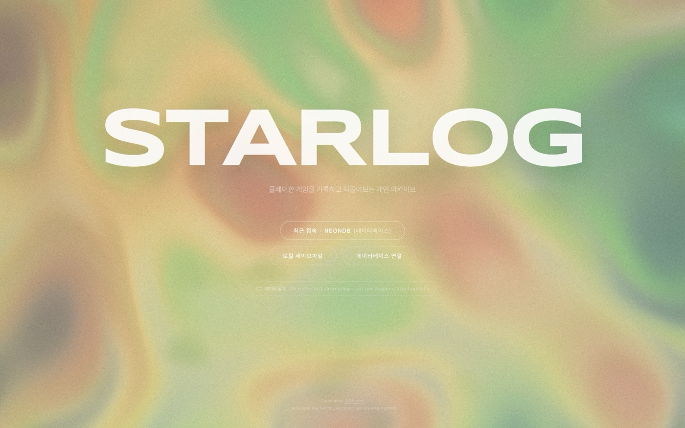
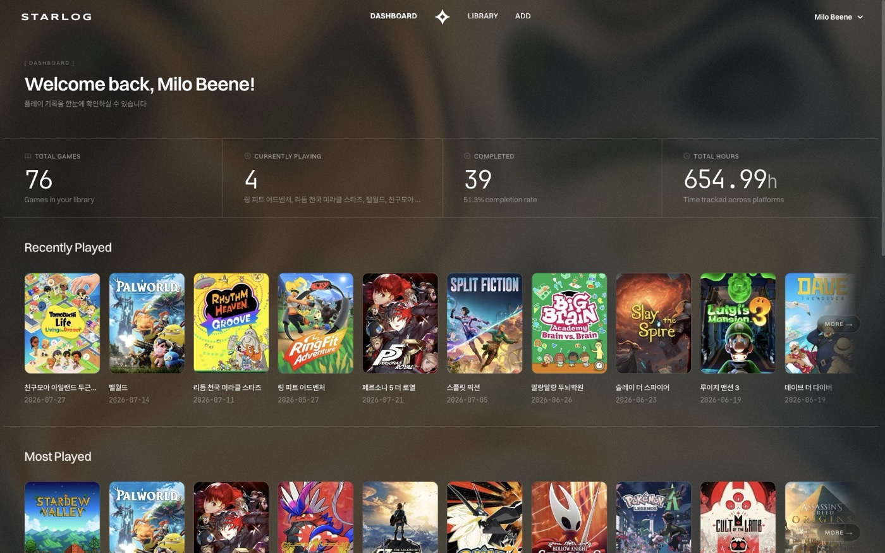
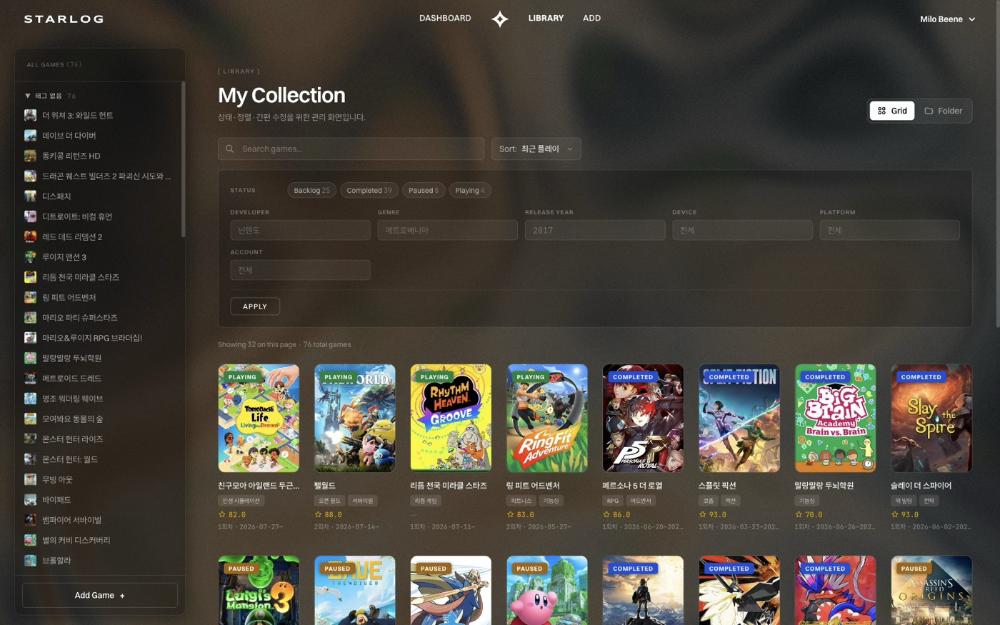
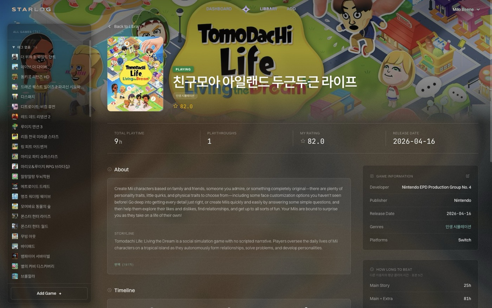

<div align="center">



# STARLOG

**내 인프라 위에서 돌아가는 게임 백로그 관리 앱**

[](https://github.com/milobeene/starlog/releases)
[](LICENSE)




</div>

---

계정도, 서버도 없습니다. 앱을 열면 바로 내 기록입니다.

기록이 있을 곳은 직접 고릅니다. 파일 하나로 두거나, 내 PostgreSQL에 올리거나,
둘 사이를 오갈 수 있습니다. 게임 정보와 번역에 쓰는 API 키도 각자의 것을 넣습니다.



## 기능

**백로그**
- 상태·평점·플레이 시간, 회차별 기록
- 회차마다 어디서 했는지 — 플랫폼 또는 에뮬레이터, 기기, 계정
- 커버 이미지와 스크린샷

**찾기**
- 세 갈래로 나뉜 검색 — 게임 자체 / 회차 / 취득
- 폴더 보기, 타임라인, 제목 검색·정렬

**게임 정보**
- IGDB에서 자동으로 채우기
- 항목별 덮어쓰기 — 마스터 정보와 내 기록을 따로 둡니다
- 소개문·스토리라인 한국어 번역 (Google Cloud Translation)

**기록**
- 취득 경로와 지출, 구독 관리
- 플랫폼 계정·보유 기기·에뮬레이터·입력 방식
- 개인 태그 — 색을 고르고, 끌어서 순서와 소속을 바꿉니다

**대시보드**
- 총 게임 수, 진행 중, 완료율, 누적 플레이 시간
- 월별 완료 추이와 월별 지출
- 최근 플레이·최다 플레이·최고 평점

**데이터**
- 로컬 세이브파일(H2) ↔ 클라우드(PostgreSQL) 전환
- 커버·스크린샷을 S3 호환 스토리지에 두는 선택
- 자동 백업 — 열 때마다, 내용이 바뀌었을 때만
- 번역 사용량과 하루 할당량을 앱 안에서 봅니다

<table>
<tr>
<td width="50%"></td>
<td width="50%"></td>
</tr>
</table>

## 설치

[Releases](https://github.com/milobeene/starlog/releases)에서 받습니다.
**자바를 따로 설치할 필요는 없습니다** — 런타임이 앱에 들어 있습니다.

| 플랫폼 | 파일 |
|---|---|
| macOS (Apple Silicon) | `STARLOG-<버전>-arm64.dmg` |
| Windows (x64) | `STARLOG-Setup-<버전>.exe` |

<details>
<summary><b>처음 열 때 경고가 나옵니다</b></summary>

<br>

코드 서명을 하지 않았습니다. 개인 프로젝트라 애플 개발자 프로그램(연 $99)과
윈도우 코드 서명 인증서를 쓰지 않습니다.

**macOS** — `'STARLOG'을(를) 열지 않음`

1. **[완료]** 를 누릅니다 (**[휴지통으로 이동]** 이 아닙니다)
2. 앱을 `/응용 프로그램`으로 옮깁니다
3. **시스템 설정 → 개인정보 보호 및 보안** 에서 **[확인 없이 열기]**

터미널로는 한 줄입니다.

```bash
xattr -dr com.apple.quarantine /Applications/STARLOG.app
```

**Windows** — `Windows에서 PC를 보호했습니다`

**[추가 정보] → [실행]**

새 버전을 받을 때마다 다시 나옵니다.

</details>

## 쓰기

앱을 열면 기록할 곳을 고르는 화면이 먼저 나옵니다.

- **로컬** — 세이브파일 하나에 전부 들어갑니다. 준비할 것이 없습니다
- **클라우드** — 내 PostgreSQL과 S3 호환 스토리지에 연결합니다

게임 검색은 [IGDB](https://api-docs.igdb.com/), 번역은
[Google Cloud Translation](https://cloud.google.com/translate)을 씁니다.
키는 앱 안 **시스템 → 연결**에서 넣습니다. 없어도 앱은 돌아가며, 검색과 번역만 쓸 수 없습니다.

## 빌드

```bash
./tools/build-jre.sh        # 번들 JRE (Temurin 21)
./tools/build-desktop.sh    # 프론트 정적 빌드 → 백엔드 jar
cd desktop && npm install && npm start
```

배포물은 `npx electron-builder --mac` 또는 `--win`으로 만듭니다.
JRE가 OS별이라 크로스 빌드는 되지 않습니다 — 각 OS에서 빌드하거나
[GitHub Actions](.github/workflows/release.yml)에 맡깁니다.

Spring Boot 4.1 · Java 21 · H2 / PostgreSQL · Next.js 16 · Electron

## 라이선스

[MIT](LICENSE). 함께 배포되는 소프트웨어의 고지는 [NOTICE](NOTICE)에 있습니다.

---

<sub>이 앱은 개발 전반에 생성형 AI를 사용해 만들었습니다.</sub>
